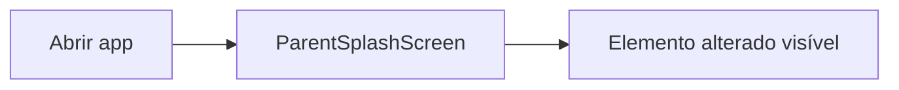

# Fluxo do usuário — regra obrigatória (frontend-mobile)

**Aplica-se a:** toda issue com `agent_role: frontend-mobile` (parent ou child).

O agente **não implementa** sem este mapa no ticket. O qa-gate valida screenshot/vídeo **seguindo os mesmos passos**.

---

## Campos obrigatórios (`refinement.user_flow`)

| Campo | Descrição |
|-------|-----------|
| `app` | `guardiao-familia-parent` ou `guardiao-familia-child` |
| `entry_point` | Ex.: cold start, usuário logado, deep link |
| `preconditions` | Emulador, Metro port, API up, sessão, etc. |
| `steps` | Lista ordenada até a tela/elemento alvo |
| `target_screen` | Nome do screen/componente React |
| `target_element` | testID, accessibilityLabel ou Text alterado |
| `navigation_files` | Arquivos que controlam rota (ex.: `App.tsx`) |
| `emulator` | Ex.: `emulator-5554` (parent) / `emulator-5556` (child) |
| `metro_port` | `8082` parent · `9090` child |

### Formato de cada step

```json
{
  "order": 1,
  "screen": "ParentSplashScreen",
  "user_action": "Abrir app (cold start)",
  "system_behavior": "Exibe splash animado",
  "file": "screens/ParentSplashScreen.tsx",
  "route_condition": "App.tsx: !startupSplashDone"
}
```

---

## Template markdown (colar na issue)

### Pré-condições

- [ ] Emulador `{emulator}` booted
- [ ] Metro `{metro_port}` · dev client instalado
- [ ] _(API / login se necessário)_

### Passos até a funcionalidade

| # | Tela | Ação do usuário | Comportamento esperado | Arquivo |
|---|------|-----------------|------------------------|---------|
| 1 | | | | |
| 2 | | | | |

**Alvo desta task:** `{target_screen}` → `{target_element}`

### Diagrama (mermaid)



### Como reproduzir (QA / Appium) — **sempre MCP**

> Reprodução E2E via MCP `guardiao-familia-agents`. Não usar scripts Appium/CLI como caminho principal.

1. `list_mcp_tools()` → `get_handoff` → `qa-gate_in_test` → `query_mobile_flow_rag` → `qa_db_seed` → `qa_appium_suite_*` → evidências → `qa_db_cleanup` → `qa-gate_in_pull_request`|`qa-gate_return_in_progress`
2. Cenários a validar (pós-suite): _(listar qa_repro_steps — ex. screenshot header, horários)_
3. Fallback CLI somente se MCP indisponível

---

## Regras para agentes

| Agente | Uso do fluxo |
|--------|----------------|
| **frontend-mobile** | Seguir passos para localizar arquivo; não editar tela errada |
| **frontend-mobile-reviewer** | Confirmar diff só afeta `target_screen` / navigation citada |
| **qa-gate** | Executar sec. 2.1 via **MCP** (`qa_appium_suite_*`); evidência deve mostrar último step |

Se o fluxo real no repo **divergir** do ticket → comentar issue e pedir correção do mapa **antes** de codar.

---

## Banco local (`mobile_user_flows.db`)

**Fonte de verdade** para fluxos 0→N, labels e telas. Populado pelo agente QA.

| Tabela | Conteúdo |
|--------|----------|
| `mobile_screens` | Componentes RN + `App.tsx` gate |
| `mobile_elements` | Text, testID, accessibilityLabel |
| `mobile_user_flows` | Fluxo indexado por `flow_id` |
| `mobile_flow_steps` | Passos ordenados 1…N |
| `mobile_discovery_runs` | Histórico execuções QA |

**Path:** `data/mobile_user_flows.db` · env `GUARDAO_MOBILE_FLOW_DB`

### Seed / atualizar (agente QA)

```powershell
cd modulo-8-exemplo-pratico-guardiao-familia-agents
python agents/01-role-based/qa-gate/scripts/qa_discover_mobile_flows.py --app both
python agents/01-role-based/qa-gate/scripts/qa_discover_mobile_flows.py --app parent --appium   # + dump UIAutomator
python agents/01-role-based/qa-gate/scripts/qa_discover_mobile_flows.py --lookup ParentSplashScreen
python agents/01-role-based/qa-gate/scripts/qa_discover_mobile_flows.py --task-id T-P3-002
```

Tickets `frontend-mobile` **puxam automaticamente** o fluxo do DB via `lib/mobile_flow_discovery.resolve_user_flow_for_task()` → sec. 2.1 no issue body.

**Lookup:** `suggested_files` + título → `flow_id` → steps completos.

Gerador issue: `lib/issue_task_body.py` · DB SQLite: `lib/mobile_user_flow_db.py`

---

## RAG — Postgres pgvector (`agent_mobile_flow_chunks`)

Camada semântica para **agentes LLM** consultarem fluxos, labels e telas.

| Etapa | Comando |
|-------|---------|
| 1. Discovery (SQLite) | `python agents/01-role-based/qa-gate/scripts/qa_discover_mobile_flows.py --app both` |
| 2. Ingest + embed | `python agents/01-role-based/qa-gate/scripts/ingest_mobile_flows_rag.py --ensure-postgres` |
| 3. Consulta MCP | tool `query_mobile_flow_rag(query="splash tagline parent")` |

**Postgres:** mesmo Docker da API (`127.0.0.1:5432/guardiao_familia`) · extensão `vector` · embeddings via OpenRouter (`GUARDAO_EMBED_MODEL`, default `text-embedding-3-small`, 1536d).

**Env:** `GUARDAO_DATABASE_URL` · `OPENROUTER_API_KEY` (dev offline: `--fake-embed`)

Cada chunk inclui passos **0→N**, arquivo, rota App.tsx e metadados JSON — usado em tickets (sec. 2.1) e no LangGraph via MCP.
