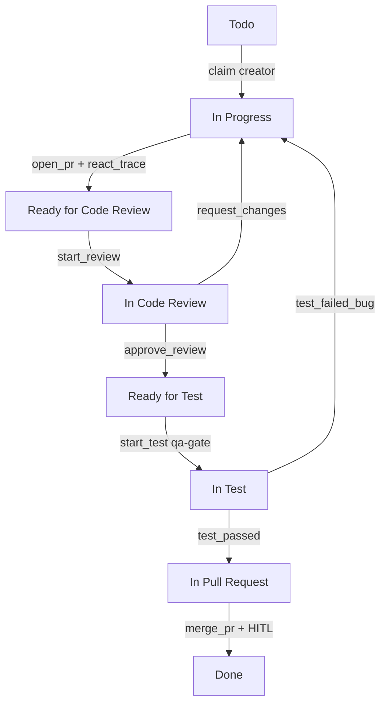

# Estado atual — fluxo e processo dos agentes

> Atualizado: 2026-08-24  
> Escopo: **como está hoje**.  
> Complementos: [CONFIGURACAO_E_TECNOLOGIA.md](CONFIGURACAO_E_TECNOLOGIA.md) · [EXECUCAO_E_OBSERVABILIDADE.md](EXECUCAO_E_OBSERVABILIDADE.md)

---

## 1. Visão do fluxo

Uma task do GitHub Project #2 (`guardiaofamilia`) percorre Status no board local (JSON espelho) e, quando o `gh` consegue, no Project remoto.

**Porta única:** todo avanço de Status passa por `emit_status_event` (`lib/gateway.py`). Não há atalho paralelo que grave Status “por fora” do gateway no fluxo oficial.

---

## 2. Quem age em cada etapa

| Status | Agente responsável | Evento típico |
|--------|--------------------|---------------|
| Todo | orchestrator / creator elegível | `claim` |
| In Progress | creator (`agent_role` do CSV) | implementação + `open_pr` |
| Ready / In Code Review | `*-reviewer` do par | `start_review`, `approve_review` / `request_changes` |
| Ready / In Test | **qa-gate** | `start_test`, `test_passed` / `test_failed_bug` |
| In Pull Request | devops-cicd / preparação de merge | `merge_pr` |
| Done | só após **HITL humano** no merge | — |

Papéis creators e reviewers vivem em `agents/*.agent.md` e `agents/reviewers/`.  
Mapeamento task → role: `TASK_AGENT_MAP.csv` + `lib/task_router.py`.

---

## 3. Processo operacional (dia a dia)

### 3.1 Pré-condições para claim

1. Task no mapa CSV com `agent_role` correto.  
2. Status local **Todo**.  
3. `depends_on` satisfeito (dependências em **Done**, ou política que permita após PR).  
4. WIP / lock do role livre (`lib/claim_lock.py`).  
5. Sem HITL bloqueando a fila de autonomia.

### 3.2 Ciclo padrão

1. **Claim** → In Progress + lock WIP.  
2. **Implementação** — em operação plena: job em `worker_jobs` → dispatch (Cursor SDK ou fallback manual) → artefato/PR; na **demo acadêmica**: `demo_apresentacao.py` grava workspace local + commit + histórico ReAct.  
3. **open_pr** exige `react_trace` (política ReAct).  
4. **Review** — LLM propõe; se alto risco / `release_blocker` → modo `propose_only` ou fila HITL.  
5. **QA-gate** — testa e emite pass/fail tipado.  
6. **In Pull Request** — automação pode parar aqui (política de autonomia até IPR).  
7. **merge_pr** → sempre `block_until_human` até `approve_hitl`.

### 3.3 Gates humanos (HITL)

Documentados em [PROCESSO_HITL.md](../operacao/PROCESSO_HITL.md):

| Gate | Momento |
|------|---------|
| H1 | approve alto risco / release_blocker |
| H2 | 3× bug de teste |
| H3 | merge_pr |
| H4 | lease/ReAct esgotado |
| H5 | disputa de fronteira |

**Importante:** não existe Status Kanban “Awaiting Human”. O board permanece no Status do fluxo; a pausa fica em `hitl_queue` (`agent_runtime.json`) e no banner do dashboard live.

---

## 4. Dois modos de execução (ambos válidos hoje)

| Modo | Script / caminho | Uso |
|------|------------------|-----|
| **Demo acadêmica paced** | `scripts/demo_apresentacao.py` | Banca: delays ≥6s, histórico thought/action, sync Project, até Done com auto-HITL |
| **Operação / piloto** | `autonomy_loop`, `pilot_session`, gateway + dispatch | Ciclo real com jobs, outbox, HITL manual |

A demo **não substitui** o produto: ela prova o **mesmo gateway, Status, papéis e Project #2**, com implementação didática local.

---

## 5. Fontes de verdade

| Artefato | Papel |
|----------|--------|
| GitHub Project #2 | Status remoto (política reconcile: Project vence) |
| `github-project-2-import.json` (módulo 7) | Espelho local de Status |
| `TASK_AGENT_MAP.csv` | Role, repo, depends_on, blocker |
| `crew/output/handoffs/{task}.json` | Contrato entre agentes |
| `crew/output/observability/tasks/{task}.html` | Histórico detalhado (demo / append explícito) |
| `crew/output/agent_runtime.json` | idle/busy, HITL, idempotência |

---

## 6. O que está estável vs o que ainda é híbrido

**Estável**

- Contrato de eventos + gateway + HITL.  
- Board local + tentativa de sync `gh` (falha → outbox).  
- Dashboard live (poll 5s) + Kanban do **piloto**.  
- Demo ponta a ponta validada (ex.: T-P05-005, T-P05-006 → Done no Project).

**Híbrido / opcional**

- Implementação no repo produto via Cursor SDK (`GUARDAO_DISPATCH_BACKEND=auto`).  
- Histórico HTML rico: gerado pela demo; piloto antigo sem `append_task_action` não cria página.  
- Kanban do dashboard **não** lista o Project inteiro (só piloto + ativos).

---

## 7. Leitura sugerida

1. Este arquivo — fluxo e processo.  
2. [CONFIGURACAO_E_TECNOLOGIA.md](CONFIGURACAO_E_TECNOLOGIA.md) — como está montado.  
3. [EXECUCAO_E_OBSERVABILIDADE.md](EXECUCAO_E_OBSERVABILIDADE.md) — como rodar e acompanhar.  
4. [../operacao/](../operacao/) — HITL e workflow canônicos.  
5. [../apresentacao/](../apresentacao/) — roteiro da demo live.
