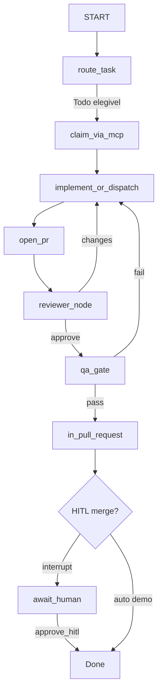

# Guia — LLM + MCP + LangGraph/LangSmith no Guardião Família (módulo 8)

> Escopo: **o que fazer** para evoluir o exemplo prático sem quebrar o contrato atual.  
> Base as-is: [ESTADO_ATUAL_FLUXO_E_PROCESSO.md](ESTADO_ATUAL_FLUXO_E_PROCESSO.md) · [CONFIGURACAO_E_TECNOLOGIA.md](CONFIGURACAO_E_TECNOLOGIA.md)

---

## 0. Premissa: o que já existe e não deve ser reinventado


| Já estável                                                                  | Papel                                      |
| --------------------------------------------------------------------------- | ------------------------------------------ |
| `lib/gateway.py` (`emit_status_event`)                                      | **Porta única** de Status + HITL + handoff |
| `lib/board_client.py`, `task_router.py`, `hitl_gates.py`, `react_policy.py` | APIs Python de domínio                     |
| `lib/model_tier.py`                                                         | Escolha low/high por risco                 |
| `langgraph_app/`                                                            | **Única** orquestração (StateGraph)        |
| `guardiao_mcp/`                                                             | Tools MCP sobre as mesmas libs             |
| `crew/output/observability/`                                                | Snapshot + dashboard live (pasta runtime)  |
| `agents/*.agent.md` + `skills/*/SKILL.md`                                   | Política e fronteiras por papel            |


**Regra de ouro:** LangGraph/MCP/LLM **chamam** o gateway e as libs; não gravam Status “por fora”.

```text
Atual:  LangGraph ──► tools_bridge / MCP ──► lib/* ──► board + Project #2
        └─ traces ──► LangSmith (+ snapshot / HTML ReAct)
```

> **Nota (2026-08-25):** CrewAI foi **removido**. `crew/` = `.env` + `requirements.txt` + `output/` apenas.

---

## 1. Objetivo da evolução

1. **LLM de verdade** no loop de decisão (rotear, revisar, resumir handoff) — não só prompts Cursor estáticos.
2. **MCP server** expondo as APIs já implementadas como tools tipadas.
3. **Agentes LangGraph** que otimizam *quais* tools chamar, em qual ordem, com menos round-trips.
4. **LangSmith** para tracing, avaliação e debug da experiência (latência, falhas HITL, loops ReAct).

Resultado esperado para o usuário (humano / banca / operador):

- menos “agente ocioso sem saber o que fazer”;
- respostas com progresso visível (thought → tool → observation);
- menos chamadas redundantes ao board/gh;
- HITL claro quando o grafo pausa.

---

## 2. Fase A — Modelo LLM (configuração e política)

### 2.1 O que fazer


| Passo | Ação                                                                                                                |
| ----- | ------------------------------------------------------------------------------------------------------------------- |
| A1    | Manter OpenRouter (`OPENAI_API_BASE`) ou ponto LiteLLM único                                                        |
| A2    | Expandir `model_tier.py`: `route` (barato/determinístico), `implement_low`, `implement_high`, `review`, `summarize` |
| A3    | Env: `CREWAI_MODEL` → renomear/alias para `GUARDIAO_LLM_*` (compatível com LangChain `ChatOpenAI`)                  |
| A4    | Separar **modelo de implementação de código** (`GUARDIAO_CURSOR_MODEL`) do **modelo de orquestração** (LangGraph)   |
| A5    | Budget: max tokens / max tool calls por nó (alinhar a `react_policy.max_iterations_for`)                            |


### 2.2 Variáveis sugeridas (`crew/.env`)

```env
# Orquestração LangGraph (OpenAI-compatible)
OPENAI_API_KEY=
OPENAI_API_BASE=https://openrouter.ai/api/v1
GUARDIAO_LLM_ROUTE=openai/gpt-4o-mini
GUARDIAO_LLM_DEFAULT=openai/gpt-4o-mini
GUARDIAO_LLM_HIGH=x-ai/grok-4.3   # SOS, pagamento, LGPD, terraform, release

# Observabilidade (LangSmith)
LANGSMITH_API_KEY=
LANGCHAIN_TRACING_V2=true
LANGCHAIN_PROJECT=guardiao-familia-agents
LANGSMITH_ENDPOINT=https://api.smith.langchain.com

# Dispatch código (inalterado)
CURSOR_API_KEY=
GUARDIAO_CURSOR_MODEL=composer-2.5
```

### 2.3 Critério de aceite

- Task low-risk usa modelo default; hint `HIGH_HINTS` usa high.  
- Roteamento claim/idle pode permanecer **sem LLM** (como hoje `purpose=route`).

**Validação (implementado):**

```powershell
python -m unittest tests.test_model_tier -v
python scripts/model_tier_cli.py --smoke --smoke-high --json
```

Código: `lib/model_tier.py` · env: `GUARDIAO_LLM_*` + `GUARDIAO_CURSOR_MODEL` (alias `CREWAI_MODEL` / `GUARDAO_CURSOR_MODEL`).

---

## 3. Fase B — MCP server sobre as APIs existentes

### 3.1 Por que MCP

Um servidor MCP vira a **fachada estável** para Cursor e LangGraph — a lógica permanece em `lib/*`; o grafo usa `tools_bridge` (e/ou MCP remoto).

### 3.2 Layout sugerido

```text
modulo-8-.../
  mcp/
    server.py          # FastMCP / mcp.server
    tools/
      gateway_tools.py   # emit_status_event, list_hitl, approve_hitl
      board_tools.py     # pick_task, claim wrappers (só via gateway quando mudar Status)
      review_tools.py
      observability_tools.py
      dispatch_tools.py  # enqueue worker / complete_dispatch (read-only + actions seguras)
    README.md
```

### 3.3 Mapa API → tool MCP (reutilizar `lib/`)


| Tool MCP                                                                | Implementação                   | Notas                   |
| ----------------------------------------------------------------------- | ------------------------------- | ----------------------- |
| `emit_status_event`                                                     | `lib.gateway.emit_status_event` | Única escrita de Status |
| `list_hitl_queue` / `approve_hitl`                                      | `lib.gateway`                   | Nunca auto-merge        |
| `list_idle_agents` / `resolve_agent_for_event` / `drain_dispatch_queue` | `lib.event_orchestrator`        | Otimiza dispatch        |
| `pick_task` / `load_tasks`                                              | `lib.task_router`               | Claim inteligível       |
| `snapshot_observability`                                                | `lib.observability`             | UX do operador          |
| `append_task_action`                                                    | `lib.task_action_history`       | Trilha ReAct para HTML  |
| `get_handoff` / `write_handoff`                                         | `lib.handoff`                   | Contrato entre nós      |
| `select_model`                                                          | `lib.model_tier`                | Antes de nós caros      |
| `dispatch_job` (opcional)                                               | `lib.dispatch_adapter`          | Só se política permitir |


**Não expor no MCP (ou expor read-only):** escrita direta em Project via `board_client.update_project_status` fora do gateway; merge sem HITL; secrets.

### 3.4 Contrato de tool (padrão)

Cada tool retorna JSON com:

```json
{ "ok": true|false, "dry_run": false, "result": {}, "error": null }
```

Parâmetro global `dry_run` (default `false` em prod, `true` em demo/banca).

### 3.5 Registro Cursor / clientes

- `mcp.json` (Cursor) apontando para `python -m mcp.server` ou `uv run`.  
- Mesmo servidor consumido pelo LangGraph via adapter MCP.

### 3.6 Critério de aceite

- `emit_status_event` via MCP produz o **mesmo** efeito que `gateway_cli.py`.  
- CrewAI removido; tools só via MCP / tools_bridge.

---

## 4. Fase C — Agentes LangGraph (orquestração + UX)

### 4.1 Papel do LangGraph vs o que já existe


| Peça atual                         | Equivalente LangGraph                       |
| ---------------------------------- | ------------------------------------------- |
| Fluxo Status (Todo → … → Done)     | **StateGraph** com nós por estágio          |
| `hitl_queue` / `block_until_human` | `interrupt()` / checkpoint + resume         |
| `react_policy`                     | loop `agent ↔ tools` com teto de iterações  |
| `event_orchestrator` idle/dispatch | nó `dispatch` + arestas condicionais        |
| (removido) CrewAI supervisor       | **LangGraph** é o único orquestrador        |


### 4.2 Estado sugerido (`AgentState`)

```python
# campos mínimos — espelham artefatos já usados
task_id: str
board_status: str
agent_role: str | None
handoff: dict
react_trace: list[dict]
hitl_pending: bool
model_tier: str
messages: list  # LangChain messages
last_tool_results: list
error: str | None
```

Checkpointer: `MemorySaver` (demo) → SQLite/Postgres (piloto) alinhado a `crew/output/`.

### 4.3 Grafo canônico (espelha o Kanban)




Cada nó:

1. Lê skill/prompt do role (`agents/{role}.agent.md` truncado + skill).
2. Decide **1–N tools MCP** (não “chamar tudo”).
3. Emite Status só por `emit_status_event`.
4. Append em `task_action_history` para o HTML live.

### 4.4 Otimização de chamadas (melhor UX + custo)


| Técnica                           | Como aplicar aqui                                                                                      |
| --------------------------------- | ------------------------------------------------------------------------------------------------------ |
| **Tool gating por estágio**       | Em `In Progress` só tools de implement/handoff; em review só review tools                              |
| **Batch read**                    | Uma tool `get_task_context(task_id)` que agrega CSV + board + handoff + HITL (em vez de 4 round-trips) |
| **Cache curto**                   | Cache de `load_tasks` / snapshot por N segundos no MCP                                                 |
| **Roteamento sem LLM**            | Nó `route_task` determinístico (`task_router` + `model_tier`)                                          |
| **LLM só quando há ambiguidade**  | Ex.: escolher entre 2 reviewers, redigir summary de PR, classificar risco                              |
| **Parallel onde o board permite** | Tasks independentes em subgraphs; **nunca** paralelizar Status da mesma task                           |
| **Structured output**             | Pydantic para `open_pr` / review verdict — menos retries                                               |
| **Early stop**                    | Respeitar `react_policy.should_stop` e H4 (lease esgotado)                                             |


### 4.5 Multi-agente (mínimo viável)

Não precisa um grafo por cada um dos 19 papéis no dia 1.

**MVP:**

1. `supervisor` — scan idle + claim/start_review/start_test
2. `creator` — implement/dispatch + open_pr
3. `reviewer` — approve / request_changes
4. `qa_gate` — test_passed / test_failed_bug
5. `human_gate` — interrupt LangGraph

Depois: especializar creators por role via prompt/skill, não por 19 grafos.

### 4.6 Integração com Cursor SDK

Manter o padrão atual: LangGraph **orquestra**; implementação pesada de código continua em `dispatch_adapter` (Cursor) quando `GUARDIAO_DISPATCH_BACKEND=auto`. O nó `implement` escolhe:

- demo → workspace markdown (como `demo_apresentacao.py`);  
- prod → enfileira job / `Agent.prompt`.

### 4.7 Critério de aceite

- Mesma task (ex. T-P05-006) percorre Status iguais à demo atual.  
- Menos de N tool calls médios por transição (baseline: medir Crew/CLI manual).  
- HITL merge ainda exige humano fora do modo demo.

---

## 5. Fase D — LangSmith (observabilidade de agentes)

### 5.1 O que LangSmith adiciona ao dashboard atual


| Atual (`observability/`)          | LangSmith                             |
| --------------------------------- | ------------------------------------- |
| Status, idle/busy, Kanban piloto  | Traces token-a-token, latência por nó |
| `workflow.jsonl` eventos de board | Cadeia LLM → tool → observation       |
| HTML por task (ReAct didático)    | Compare runs, datasets, feedback      |


**Não substituir** o dashboard live na banca: ele fala a língua do Project #2. LangSmith é para **engenheiro/agente**.

### 5.2 O que fazer


| Passo | Ação                                                                                |
| ----- | ----------------------------------------------------------------------------------- |
| D1    | Ativar tracing (`LANGCHAIN_TRACING_V2`) no entrypoint do grafo                      |
| D2    | `traceable` / run names: `claim`, `open_pr`, `review`, `qa`, `hitl`                 |
| D3    | Metadata: `task_id`, `agent_role`, `model_tier`, `dry_run`, `sprint`                |
| D4    | Dataset de regressão: 5–10 tasks piloto com expected Status sequence                |
| D5    | Avaliadores simples: “emitiu evento inválido?”, “pulou HITL?”, “excedeu iterações?” |
| D6    | Opcional: webhook/export de falhas → comentário no `workflow.jsonl`                 |


### 5.3 Critério de aceite

- Cada run de autonomia aparece no projeto LangSmith com spans de tools MCP.  
- Dá para abrir um run e ver por que uma task foi para HITL.

---

## 6. Ordem de implementação recomendada

```text
Semana 1  A (LLM env + model_tier) + B1 (MCP: só gateway + list_hitl + snapshot)
Semana 2  B2 (restante das tools) + smoke Cursor MCP
Semana 3  C MVP LangGraph (supervisor + 4 nós) dry_run
Semana 4  C HITL interrupt + integração dispatch Cursor
Semana 5  D LangSmith datasets + comparar custo vs baseline CLI
Semana 6  Otimização get_task_context (CrewAI já removido)
```

**Não fazer no início:** reescrever o board, abandonar o gateway, ou trocar o Kanban por UI LangSmith.

---

## 7. Dependências sugeridas

Deps em `crew/requirements.txt` (LangGraph / MCP / LangSmith — **sem** CrewAI):

```text
langgraph>=0.2
langchain>=0.3
langchain-openai>=0.2
langsmith>=0.1
mcp>=1.9,<2
```

Entry points:


| Script                                                       | Função                                                 |
| ------------------------------------------------------------ | ------------------------------------------------------ |
| `python -m guardiao_mcp`                                     | Sobe MCP                                               |
| `python scripts/langgraph_run.py --task T-P05-006 --mode dry_run` | Um ciclo do grafo                                 |
| `python scripts/demo_apresentacao.py`                        | Demo gateway (Status); não usa CrewAI                  |


---

## 8. Riscos e mitigação


| Risco                      | Mitigação                                                                    |
| -------------------------- | ---------------------------------------------------------------------------- |
| LLM inventa Status         | Tools só via gateway; schema estrito; rejeitar evento fora de `EVENT_TARGET` |
| Loop infinito tool-calling | `react_policy` + max steps no nó + LangSmith alert                           |
| Dupla escrita (legado)     | Só `GUARDIAO_ORCHESTRATOR=langgraph` (CrewAI removido)               |
| Secrets no MCP             | Server local; sem expor `GITHUB_TOKEN` como tool                             |
| Custo OpenRouter           | route sem LLM; batch context; modelo high só com hints                       |


---

## 9. Checklist prático (definição de pronto)

- [ ] MCP: `emit_status_event` parity com `gateway_cli`  
- [ ] MCP: tools de idle/HITL/observability  
- [ ] LangGraph: grafo MVP com checkpoint + interrupt HITL  
- [ ] Prompts carregados de `agents/` + `skills/`  
- [ ] `model_tier` usado antes de nós caros  
- [ ] LangSmith: traces com `task_id`  
- [ ] Demo T-P05-005/006 ainda fecha em Done (modo demo)  
- [ ] Dashboard live continua a refletir Status  
- [ ] Documentar flag de orquestrador em CONFIGURACAO_E_TECNOLOGIA.md  

---

## 10. Leitura cruzada

1. [ESTADO_ATUAL_FLUXO_E_PROCESSO.md](ESTADO_ATUAL_FLUXO_E_PROCESSO.md) — Status e papéis
2. [CONFIGURACAO_E_TECNOLOGIA.md](CONFIGURACAO_E_TECNOLOGIA.md) — env e artefatos
3. [EXECUCAO_E_OBSERVABILIDADE.md](EXECUCAO_E_OBSERVABILIDADE.md) — como rodar hoje
4. [../operacao/PROCESSO_HITL.md](../operacao/PROCESSO_HITL.md) — gates humanos (mapear para `interrupt`)
5. `guardiao_mcp/server.py` — catálogo MCP atual
6. [orquestracao/](orquestracao/README.md) — mapa didático visual

---

## Resumo em uma frase

**Expor `lib/`* via MCP, orquestrar o Kanban com LangGraph (HITL = interrupt), escolher LLM por `model_tier`, e observar com LangSmith — sem abrir uma segunda porta de Status fora do gateway.**