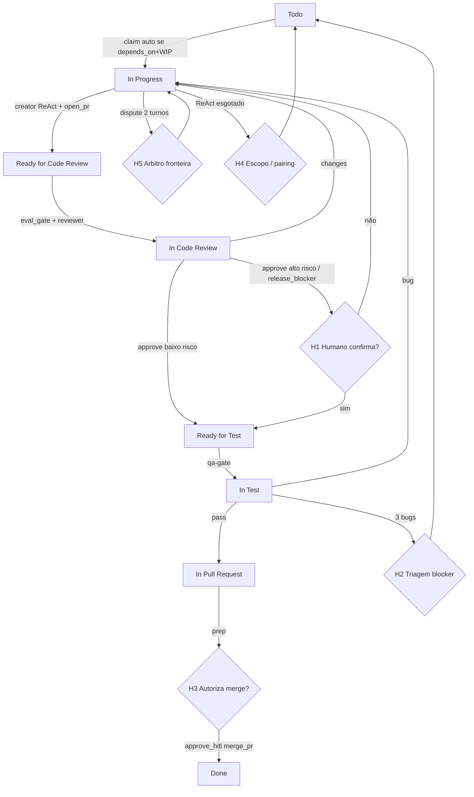

# Processo e pontos de entrada humana (HITL)

Atualizado: 2026-08-24 — alinhado ao gateway, worker local e dispute.

---

## 1. Fluxo com humano



---

## 2. Gates humanos (obrigatórios)

| # | Momento | Por quê | Ação | Como |
|---|---------|---------|------|------|
| **H1** | `approve_review` alto risco **ou** `release_blocker` | Erro caro / release | Confirma ou pede changes | `gateway_cli --list-hitl` + `--approve-hitl` |
| **H2** | 3× `test_failed_bug` | Spec ruim / flaky / skill errada | Triagem flaky vs regression | Liberar blocker / split / reopen |
| **H3** | `merge_pr` | Irreversível | Autoriza merge pós-CI | `--event merge_pr --approve-hitl` |
| **H4** | Lease worker TTL / ReAct no limite | Automação esgotada | Redefine escopo ou pairing | `worker_run --expire` + HITL |
| **H5** | `dispute_run` (2 turnos) | Conflito de fronteira (ex. API×DB) | Escolhe contrato | Lê `agents/00-runtime/output/disputes/*` |

---

## 3. Automação ok (sem humano)

- Claim com lock/WIP/`depends_on`  
- Enfileirar job + bundle Cursor  
- `open_pr` (com schema + react_trace)  
- Start review / start test  
- Approve baixo risco **após** eval_gate ok  
- `test_passed` → In Pull Request  
- Labels `agent:*` + Status Project  
- `ci_hint --green` só enfileira qa-gate (não Done)  
- Reconcile Project→JSON quando alinhado (`--force` só com intenção)

---

## 4. Personas

| Persona | Gates |
|---------|-------|
| Tech lead / EM | H1, H2, H4, H5 |
| Owner do repo | H3 |
| Compliance / produto | H1 LGPD/consent, H3 stores |
| QA lead | H2 quando `bug_kind=flaky` |

---

## 5. Operação da fila

```powershell
python agents/00-orchestration/scripts/cli/gateway_cli.py --list-hitl
python agents/00-orchestration/scripts/cli/gateway_cli.py --task T-XXX --event merge_pr --approve-hitl
python agents/00-orchestration/scripts/cli/gateway_cli.py --task T-XXX --roles backend,database
```

Runtime: `hitl_queue` em `agent_runtime.json`.  
Audit: `audit-trail.jsonl`.

---

## 6. Princípios

1. Automação **propõe**; humano **dispõe** no irreversível/regulado.  
2. Um gateway — Status só via `emit_status_event`.  
3. Decisão humana com handoff (PR, eval_gate, dispute turns, ReAct).  
4. Fail closed — dúvida/limite → HITL, nunca Done silencioso.  
5. Issues reais + labels — lock operacional também no WIP local.
