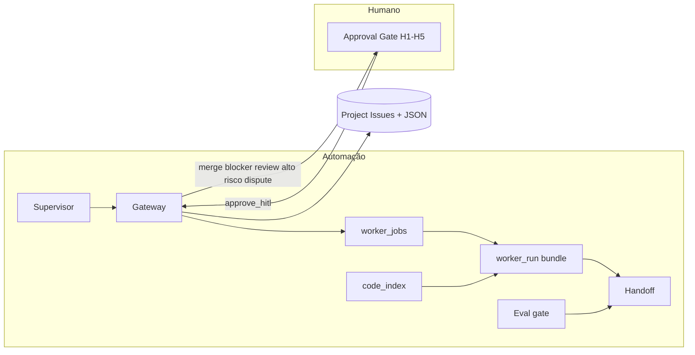

# Relatório — Como os agentes trabalham (Módulo 8)

> Runtime: `modulo-8-exemplo-pratico-guardiao-familia-agents`  
> Atualizado: 2026-08-24 — conversão Draft→Issue + plano A–E fechado no código

---

## 1. Modelo mental



- Kanban = **Sequential**; entre tasks = **Parallel** (WIP 1 por role).
- Cards do Project #2 são **Issues** reais (convertidos dos drafts).
- Supervisor só roteia; worker local gera bundle Cursor.

---

## 2. Papéis

| Papel | Faz | Não faz |
|-------|-----|---------|
| orchestrator / supervisor | claim/start_*, fila, HITL list | código, merge |
| Creators (+ **qa-author**) | Todo → ReAct → open_pr | gate de teste; merge |
| Reviewers | checklist + veredito | merge; alto risco = proposta |
| **qa-gate** | Ready/In Test | claim harness Todo |
| humano | H1–H5 | — |

CSV `agent_role=qa` → claim como **qa-author**.

---

## 3. Ciclo de uma feature

1. `depends_on` ok + lock/WIP → `claim` (gateway).  
2. Job em `worker_jobs` → `worker_run.py --next` → bundle Cursor.  
3. Creator ReAct (≤4) + `code_index` opcional → `open_pr` com `react_trace` + `pr_url`.  
4. `eval_gate.py` antes do approve; reviewer LLM.  
5. Alto risco / `release_blocker` → HITL.  
6. qa-gate → pass/bug tipado; 3 bugs → blocker + HITL.  
7. `merge_pr` → **sempre HITL**.  
8. Disputa de contrato → `dispute_run.py` (2 turnos) → HITL H5.

---

## 4. Porta única e contratos

```powershell
python scripts/gateway_cli.py --task T-XXX --event claim --dry-run
python scripts/gateway_cli.py --list-hitl
python scripts/outbox_retry.py --once
python scripts/reconcile_board.py --dry-run   # Project → JSON (conflitos exigem --force)
```

Schema: `schemas/board_events.json` + `lib/event_schema.py`.  
Outbox: falha `gh` não some — `crew/output/outbox.jsonl`.

---

## 5. Worker local

```powershell
python scripts/worker_run.py --enqueue --task T-XXX --role backend
python scripts/worker_run.py --next --role backend
# cole o prompt_bundle no Cursor
python scripts/worker_run.py --complete --job {job_id}
python scripts/worker_run.py --expire
```

---

## 6. Qualidade e índice

```powershell
python scripts/eval_gate.py --task T-XXX --write-handoff
python scripts/code_index.py --role backend --query SOS
python scripts/ci_hint.py --task T-XXX --green
python scripts/dispute_run.py --task T-XXX --roles backend,database
python -m unittest tests.test_merge_owner -v
```

Model tier: `lib/model_tier.py` (`GUARDIAO_LLM_*`; alias legado `CREWAI_MODEL*`).
Orquestração: **LangGraph** (`scripts/langgraph_run.py`).

---

## 7. Dependências

Coluna `depends_on` em `TASK_AGENT_MAP.csv` (ex.: `T-I01-002` → `T-I01-001`).  
Claim recusa se dependência ≠ `Done`.

---

## 8. Observabilidade

| Artefato | Path |
|----------|------|
| Runtime | `crew/output/agent_runtime.json` |
| Jobs | `crew/output/worker_jobs.json` |
| Handoffs | `crew/output/handoffs/` |
| Disputes | `crew/output/disputes/` |
| Audit | `crew/output/audit-trail.jsonl` |
| Convert log | `crew/output/convert_drafts_log.jsonl` |
| Item cache | `crew/output/project_item_cache.json` |

---

## 9. Critérios mínimos (plano) — status

- [x] Claim concorrente / WIP  
- [x] Outbox `gh`  
- [x] `worker_run` bundle  
- [x] `open_pr` + `react_trace`  
- [x] `depends_on` + `release_blocker` HITL  
- [x] Dispute 2 turnos + HITL  
- [x] Teste stores vs devops  
- [x] Drafts → Issues + labels `agent:*`
