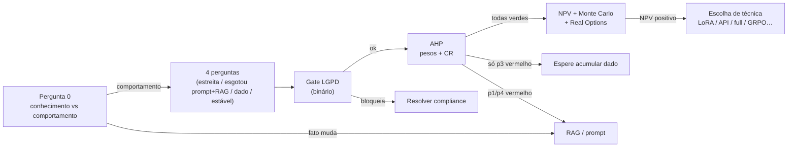

# Relatório Didático — Decision Framework (Fine-Tuning)

> Análise da aula `modulo-9-exemplo-1-decision-framework`  
> Material UNIPDS: [modulo-01-decision-framework](https://github.com/unipds-engenharia-de-ia-aplicada/engenharia-de-software-com-ia-aplicada/tree/main/modulo09-processamento-de-dados-e-fine-tuning-de-modelos/modulo-01-decision-framework)  
> Caso de estudo: **Amplitude Seguros** (Auto · Saúde Empresarial · Atendimento)

---

## 1. Objetivo da aula

Ensinar a **decidir se fine-tuning vale a pena** antes de gastar orçamento de treino — e, se valer, **qual tipo** (full, LoRA, QLoRA, instruction, RLHF/DPO, distillation, GRPO/RFT).

A mensagem central: fine-tuning **ensina comportamento e formato**, não fato novo. Fato que muda → **RAG**. Formato/tom/estrutura estáveis → candidato a fine-tuning.

---

## 2. Estrutura pedagógica (3 camadas)

| Camada | Artefato | Papel |
|--------|----------|-------|
| **1.1 Gate conceitual** | `decision-framework-checklist.md` + pôster | Pergunta 0 + 4 perguntas (verde/vermelho) |
| **1.2 Decisão financeira** | `decision_framework_tool.py` / `.js` + `amplitude-seguros-casos.json` | Governança LGPD → AHP → NPV → Monte Carlo → Real Options |
| **1.3 Zoo de técnicas** | `fine-tuning-types-cheatsheet.md` + `grpo_*_demo.*` + HTML companions | 7 tipos com custo, hardware e caso real |



---

## 3. Conceitos-chave

### 3.1 Pergunta 0 (elimina antes de tudo)

| Se… | Então… |
|-----|--------|
| A resposta muda porque um **fato** mudou (preço, política, regra) | **RAG**, não fine-tuning |
| Precisa de **tom, estrutura e formato** consistentes | Segue para as 4 perguntas |

### 3.2 As quatro perguntas (limiar 0,60)

| # | Pergunta | Sinal verde | Sinal vermelho |
|---|----------|-------------|----------------|
| 1 | Tarefa estreita/repetida? | Descreve numa frase que vale pra quase todo caso | “Às vezes X, às vezes Y” |
| 2 | Esgotou prompt + RAG + roteamento + cache? | Ainda falha ou fica caro em escala | Nem tentou prompt de verdade |
| 3 | Tem dado suficiente e diverso? | Histórico real de entrada/saída | Teria que inventar do zero |
| 4 | Schema estável? | Contrato que muda raramente | Cada área pede formato diferente |

**Regra:** uma vermelha já desaconselha treinar. Escada antes do FT: prompt → context/RAG → Agent Skills → fine-tuning.

### 3.3 Pipeline da ferramenta (M1.2)

Rodado localmente: `python decision_framework_tool.py` — **25 testes OK**.

1. **Governança LGPD** (binária, antes de tudo): base legal; se dado sensível → DPA assinado  
2. **AHP (Saaty)**: matriz pareada → pesos; CR deve ser &lt; 0,10  
3. **Gate das 4 perguntas**: não é média compensatória — uma falha reprova  
4. **NPV/DCF**: custo de treino vs economia mensal (status quo → modelo FT)  
5. **Monte Carlo** (10k sims): distribuição triangular de crescimento/custos  
6. **Real Options**: só se a única falha for **p3** (dado) → valor de esperar N meses  
7. **Sensibilidade**: ranking tipo tornado chart

Pesos AHP derivados neste material: **p3=0,455** (dado) · **p4=0,263** · **p1=p2=0,141** · CR≈0,004 (consistente).

---

## 4. Os três casos Amplitude — resultados reais

| Caso | Tarefa | Gate | Recomendação | Leitura didática |
|------|--------|------|--------------|------------------|
| **Auto** | Extrair segurado, placa, valor de orçamento | 4× verde (composto 0,88) | **Fine-tuning vale a pena** | NPV ~R$ 4,8k / 24m; breakeven mês 10; P(NPV&gt;0)=100% |
| **Saúde Empresarial** | Extrair beneficiário/procedimento/valor + cruzar cadastro | p3 vermelho (0,35) | **Espere acumular dado** | Gate ok (dado sensível + DPA); Real Options: ~9 meses, valor de esperar ~R$ 230 |
| **Atendimento** | Negociar contestações abertas | p1 e p4 vermelhos | **Continue prompt + RAG** | Tem dado de sobra (p3=0,92) — faltam formato fixo e estabilidade de regra |

**Moraleja da aula:** três tarefas na mesma empresa → três respostas diferentes. Volume de dado sozinho não justifica treinar.

---

## 5. Zoo de técnicas (M1.3) — mapa rápido

| Técnica | Hardware típico (7B) | Quando |
|---------|----------------------|--------|
| Full FT | ~100–120 GB VRAM | Domínio muito distante + orçamento alto |
| **LoRA** | ~16–24 GB | **Default de produção** |
| QLoRA | ~10–14 GB | GPU de consumidor |
| Instruction tuning | Depende do método base | Generalizar a instruções novas |
| RLHF / DPO | + infra de preferência | Alinhar tom (DPO mais simples) |
| Distillation | Tamanho do aluno | Cortar custo de inferência |
| GRPO / RFT | Várias gerações/prompt | Recompensa **verificável** (schema, testes, math) |

Riscos operacionais tratados no material: descontinuação de APIs self-serve (OpenAI/Gemini) e **obsolescência** (caso Harvey: FT vence, fronteira alcança, precisa reavaliar).

Demo GRPO (opcional, precisa Ollama): `python grpo_verifiable_reward_demo.py` — amostra G=6 respostas, recompensa verificável, vantagem relativa; **não** atualiza pesos.

---

## 6. Mapa de arquivos

```
modulo-9-exemplo-1-decision-framework/
├── decision-framework-checklist.md      # Gate 1.1
├── amplitude-seguros-casos.json         # Inputs dos 3 casos + AHP + financeiro
├── decision_framework_tool.py / .js     # Pipeline 1.2 (teste + demo)
├── fine-tuning-types-cheatsheet.md      # Zoo 1.3
├── fine-tuning-zoo-poster.png / .html   # Visual do zoo
├── mecanismo-estado-arte-companion.html # “Bestiário” teórico
├── grpo_verifiable_reward_demo.py / .js # Demo espécie 7
├── Atividade 1 / Exemplo - Módulo 1.pdf # Material de aula UNIPDS
└── docs/RELATORIO_DIDATICO_AULA.md      # Este relatório
```

---

## 7. Roteiro sugerido da aula (90–120 min)

1. **(10 min)** Pergunta 0 + erro caro (“FT como se ensinasse fato”)  
2. **(15 min)** Checklist das 4 perguntas no quadro / pôster  
3. **(25 min)** Rodar `python decision_framework_tool.py` e ler Auto vs Saúde vs Atendimento  
4. **(20 min)** Abrir o cheatsheet: por que LoRA é default; quando GRPO faz sentido  
5. **(15 min)** Exercício: aluno aplica as 4 perguntas a uma tarefa do próprio trabalho  
6. **(10 min)** Ponte → M9 Ex.2 (preparação de datasets) se a decisão for “sim” ou “ainda não”

### Comandos

```bash
cd modulo-9-exemplo-1-decision-framework
python decision_framework_tool.py
# opcional (Ollama local):
python grpo_verifiable_reward_demo.py
```

---

## 8. Critérios de aprendizagem (aceite didático)

- [ ] Diferenciar problema de **conhecimento** (RAG) vs **comportamento** (FT)  
- [ ] Aplicar as 4 perguntas e aceitar que **uma vermelha** basta para não treinar  
- [ ] Explicar por que Auto = sim, Saúde = esperar, Atendimento = prompt+RAG  
- [ ] Citar LGPD como gate **não compensável** por NPV alto  
- [ ] Escolher, em alto nível, LoRA vs full vs GRPO para um cenário dado  

---

## 9. Ponte com o restante do Módulo 9

| Próximo exemplo | Relação com esta aula |
|-----------------|------------------------|
| Ex.2 Preparação de datasets | Resolve o gargalo da **p3** (dado) e PII |
| Ex.3 Fine-tuning via API | Executa o “sim” do Auto em provedor vivo (Vertex etc.) |
| Ex.4 LoRA/PEFT | Técnica default quando o gate aprovou |
| Ex.5 Avaliação | Confirma se o FT entregou o NPV/qualidade prometidos |
| Ex.6 Projeto final | Fecha o ciclo Amplitude end-to-end |

---

## 10. Aplicação dos conhecimentos desta aula ao Módulo 8 (prático)

Os mesmos conceitos (Pergunta 0, 4 perguntas, analogia Amplitude, zoo de técnicas) foram aplicados ao exemplo prático **Guardião Família agents** (LangGraph + MCP):

→ [`APLICACAO_M9_AO_GUARDIAO_M8.md`](./APLICACAO_M9_AO_GUARDIAO_M8.md)

**Resumo da decisão exportada:** fine-tuning do código/API/views do Guardião = **não**; estratégia dominante = **RAG + tools MCP de retrieval** no orquestrador; LoRA só se, depois do RAG, o formato de plano/evidência ainda falhar de forma sistemática.

---

*Relatório com base na leitura dos artefatos e na execução local de `decision_framework_tool.py` (25/25 testes).*
