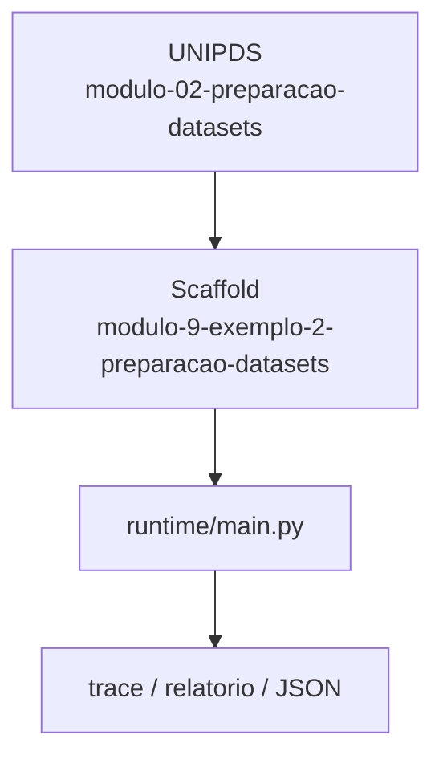
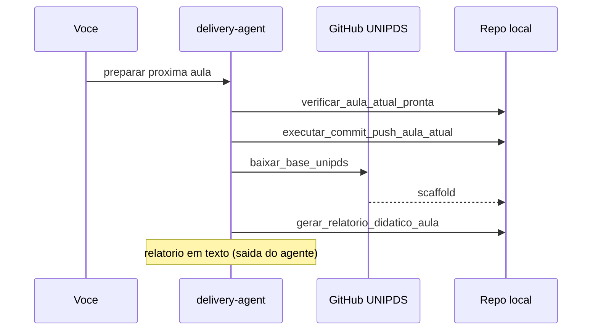

# Relatorio Didatico — Preparacao de Datasets

> Gerado pelo **delivery-agent** apos o scaffold da proxima aula.
> Pasta: `modulo-9-exemplo-2-preparacao-datasets` | Modulo 9 Exemplo 2 | [modulo-02-preparacao-datasets](https://github.com/unipds-engenharia-de-ia-aplicada/engenharia-de-software-com-ia-aplicada/tree/main/modulo09-processamento-de-dados-e-fine-tuning-de-modelos/modulo-02-preparacao-datasets)

---

## Resumo visual

### Arquitetura do exemplo



### Fluxo de preparacao



### Mapa do scaffold

```
modulo-9-exemplo-2-preparacao-datasets/
├── README.md
└── ... (21 arquivos)
```

---

## Principais topicos abordados

### 1. Pipeline de dados

Extracao multimodal, limpeza, balanceamento e scoring de relevancia.

**Exemplo de uso:**
```bash
python extracao_llm_multimodal_tool.py && python dataset_cleaning_balancing_tool.py
```

### 2. PII scrubbing gate

Gate de privacidade antes de montar JSONL de treino.

**Exemplo de uso:**
```bash
python pii_scrubbing_gate_tool.py
```

### 3. Dataset Amplitude

JSONL de treino pronto + documentos brutos de referencia.

**Exemplo de uso:**
```bash
cat dataset-amplitude-seguros.jsonl
```


---

## Secoes do README local

- Objetivo
- Pré-requisitos
- Configuração
- Como executar
- Critérios de sucesso

---

## Comandos CLI detectados

| Comando | Uso |
|---------|-----|
| `rodar` | `python main.py rodar --agente ../monitor-agent` |
| `validar` | `python main.py validar --agente ../monitor-agent` |


---

## Arquivos-chave

- (estrutura em construcao)

---

## Proximos passos

1. Leia `README.md` e o material UNIPDS
2. Configure `.env` (nunca commite segredos)
3. `python main.py validar --agente ../monitor-agent`
4. Execute a atividade e valide criterios de sucesso

---

*Gerado por `gerar_relatorio_didatico_aula` (delivery-agent).*
