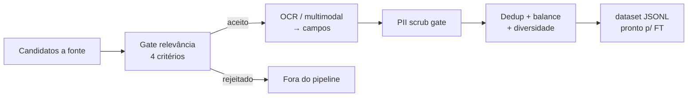

# Relatório Didático — Preparação de Datasets

> Análise da aula `modulo-9-exemplo-2-preparacao-datasets`  
> Material UNIPDS: [modulo-02-preparacao-datasets](https://github.com/unipds-engenharia-de-ia-aplicada/engenharia-de-software-com-ia-aplicada/tree/main/modulo09-processamento-de-dados-e-fine-tuning-de-modelos/modulo-02-preparacao-datasets)  
> Caso: **Amplitude Seguros** (Auto · Saúde) — continua o Decision Framework do Ex.1

---

## 1. Objetivo da aula

Operacionalizar a **p3** do Ex.1 (“tem dado suficiente?”): não basta volume — é preciso **escolher fontes**, **extrair** com schema, **higienizar PII**, **deduplicar/balancear** e medir **diversidade** antes de qualquer job de fine-tuning.

**Mensagem central:** curadoria de fonte bate dataset gigante e ruidoso (LIMA / Data-Centric AI).

---

## 2. Estrutura pedagógica (3 camadas)

| Camada | Artefato (`materiais_aula/`) | Papel |
|--------|------------------------------|-------|
| **2.1 Relevância + extração** | `data_relevance_scoring_tool` · `extraction_to_jsonl_tool` · `documentos-brutos/` · `ocr-vs-llm-extracao-comparativo.md` | Gate de 4 critérios → OCR (+ multimodal) → JSONL |
| **2.1 Privacidade** | `pii_scrubbing_gate_tool` · `privacy-preserving-finetuning-companion.md` | Scrub depois do gate LGPD do Ex.1 |
| **2.2 Limpeza** | `dataset_cleaning_balancing_tool` · `de-para-bibliotecas-de-mercado.md` | MinHash+LSH, temperatura, Shannon/Hill |



---

## 3. Conceitos-chave

### 3.1 Gate de relevância (4 critérios, todos obrigatórios)

1. Contém ground truth observável  
2. Vem de produção real (não hipotético)  
3. Cobre variação real de formato  
4. Passa compliance / sensibilidade  

### 3.2 Extração: OCR clássico vs LLM multimodal

Nos 4 documentos sintéticos de `documentos-brutos/`: **12/12 campos** nos dois lados. A diferença é engenharia (regex por layout vs prompt único; custo/latência/rede).

### 3.3 Privacidade (depois do gate LGPD do Ex.1)

- Scrub PII/PHI (Presidio / regex+NER; demo com CPF Módulo 11)  
- DP-SGD / DP-LoRA quando scrub não zera risco (Saúde)  
- Fine-tuning federado quando não se pode centralizar dado  
- Risco de memorização em datasets pequenos e específicos  

### 3.4 Limpeza e diversidade

- Dedup: MinHash + LSH (família NEARDUP)  
- Balanceamento: amostragem por temperatura (α≈0.3, estilo mT5)  
- Diversidade: entropia de Shannon + número efetivo de fontes (Hill)  

---

## 4. Mapa de arquivos

```
modulo-9-exemplo-2-preparacao-datasets/
├── README.md
├── docs/
│   ├── RELATORIO_DIDATICO_AULA.md
│   └── APLICACAO_M9_EX2_AO_GUARDIAO_M8.md
└── materiais_aula/
    ├── data_relevance_scoring_tool.py / .js
    ├── extraction_to_jsonl_tool.py / .js
    ├── extracao_llm_multimodal_tool.py / .js
    ├── pii_scrubbing_gate_tool.py / .js
    ├── dataset_cleaning_balancing_tool.py / .js
    ├── dataset-amplitude-seguros.jsonl
    ├── documentos-brutos/
    ├── ocr-vs-llm-extracao-comparativo.md
    ├── privacy-preserving-finetuning-companion.md
    ├── de-para-bibliotecas-de-mercado.md
    └── Atividade 2 / Exemplo - Módulo 2.pdf
```

---

## 5. Roteiro sugerido (90–120 min)

1. **(10 min)** Ponte Ex.1 → p3 / Saúde “ainda não”  
2. **(15 min)** Gate de relevância — ver rejeições de propósito  
3. **(25 min)** OCR → JSONL + ler comparativo OCR vs multimodal  
4. **(20 min)** PII gate + companion (DP / federado / memorização)  
5. **(15 min)** Cleaning/balancing — interpretar diversidade  
6. **(10 min)** Ponte Guardião: corpus RAG, não FT de código  

### Comandos

```bash
cd modulo-9-exemplo-2-preparacao-datasets/materiais_aula
python data_relevance_scoring_tool.py
python extraction_to_jsonl_tool.py   # precisa tesseract+por
python pii_scrubbing_gate_tool.py
python dataset_cleaning_balancing_tool.py
```

---

## 6. Critérios de aprendizagem

- [ ] Diferenciar coletar tudo vs curar fontes  
- [ ] Citar os 4 critérios do gate de relevância  
- [ ] Explicar quando OCR local vence multimodal (e o inverso)  
- [ ] Relacionar PII scrub ao gate LGPD do Ex.1  
- [ ] Ligar o pipeline ao ingest RAG do Guardião M8  

---

## 7. Ponte com o restante do Módulo 9

| Exemplo | Relação |
|---------|---------|
| Ex.1 Decision Framework | Decide *se* FT; Ex.2 prepara o *dado* |
| Ex.3 Fine-tuning via API | Consome JSONL limpo |
| Ex.4 LoRA/PEFT | Treina sobre o dataset preparado |
| Ex.5 Avaliação | Mede qualidade pós-treino |
| Ex.6 Projeto final | Escala o ciclo Amplitude |

---

## 8. Aplicação ao Módulo 8 (prático)

→ [`APLICACAO_M9_EX2_AO_GUARDIAO_M8.md`](./APLICACAO_M9_EX2_AO_GUARDIAO_M8.md)

**Resumo:** as mesmas etapas (relevância → extração tipada → PII → limpeza) aplicam-se ao corpus que alimenta `mobile_flow_rag` / code index do Guardião — alinhado à decisão do Ex.1 de **RAG, não FT de código**.

---

*Relatório alinhado ao padrão do Ex.1 (`docs/` + `materiais_aula/`) e à leitura dos artefatos UNIPDS desta pasta.*
