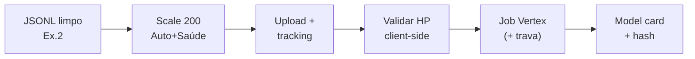

# Relatório Didático — Fine-Tuning via API

> Análise da aula `modulo-9-exemplo-3-fine-tuning-via-api`  
> Material UNIPDS: [modulo-03-fine-tuning-via-api](https://github.com/unipds-engenharia-de-ia-aplicada/engenharia-de-software-com-ia-aplicada/tree/main/modulo09-processamento-de-dados-e-fine-tuning-de-modelos/modulo-03-fine-tuning-via-api)  
> Caso: **Amplitude Seguros** em **Vertex AI** (Gemini) — executa o “sim” do Ex.1 com dataset do Ex.2

---

## 1. Objetivo da aula

Operar fine-tuning **via API gerenciada**: dataset em escala de treino, upload, job, hiperparâmetros, automação segura e **model card** com linhagem auditável.

**Mensagem central:** provedor vivo ≠ “apertar botão”. Validação local e confirmação explícita evitam gasto silencioso (caso real: `epoch_count=0` aceito pela Vertex).

---

## 2. Estrutura pedagógica (3 camadas)

| Camada | Artefato (`materiais_aula/`) | Papel |
|--------|------------------------------|-------|
| **3.2 Dataset + job** | `m3_dataset_scaling_tool` · `dataset_upload_and_tracking_tool` · `reavaliacao_saude_empresarial` | 200 exemplos; callback Ex.1; tracking REST |
| **3.3–3.4 Controle** | `hyperparameter_and_monitoring_tool` · `finetuning_automation_tool` | Validar HP; automação com `confirmar=True` |
| **3.5 Artefato** | `model_versioning_tool` · `model-card-*.md` · Dolly opcional | SHA-256, ficha, dataset alternativo |



---

## 3. Conceitos-chave

### 3.1 Callback Saúde (Real Options do Ex.1)

No Ex.1, Saúde falhava só em **p3** (“ainda não”). Após 9 meses na taxa já projetada, `reavaliacao_saude_empresarial` **reabre o mesmo framework** — se o job misto Auto+Saúde existe, é porque o critério passou, não porque mudou a regra.

### 3.2 Scaling reutiliza Ex.2

`m3_dataset_scaling_tool` importa MinHash/temperatura/Shannon do Ex.2: 305 brutos → 300 dedup → **200 balanceados** (120 Auto + 80 Saúde) — volume do job real documentado no model card.

### 3.3 Gap da API (hiperparâmetro)

Pedir HP inválido **não** falha barato: job entra em RUNNING e consome. Mitigação: validar **antes** de qualquer chamada (`hyperparameter_and_monitoring_tool`).

### 3.4 Automação com trava

`finetuning_automation_tool` só cria job novo com confirmação explícita; a demo principal **reusa** job existente para provar acompanhamento ponta a ponta sem novo custo.

### 3.5 Model card

Exemplo publicado (`model-card-amplitude-auto-saude-m3-200.md`): base `gemini-2.5-flash`, 200 exemplos, LoRA rank 4, ~46 min, hash SHA-256 do JSONL, endpoint e custo reais.

---

## 4. Mapa de arquivos

```
modulo-9-exemplo-3-fine-tuning-via-api/
├── README.md
├── docs/
│   ├── RELATORIO_DIDATICO_AULA.md
│   └── APLICACAO_M9_EX3_AO_GUARDIAO_M8.md
└── materiais_aula/
    ├── gcp-setup-companion.md
    ├── m3_dataset_scaling_tool.py / .js
    ├── reavaliacao_saude_empresarial.py / .js
    ├── dataset_upload_and_tracking_tool.py / .js
    ├── hyperparameter_and_monitoring_tool.py / .js
    ├── finetuning_automation_tool.py / .js
    ├── model_versioning_tool.py / .js
    ├── model-card-*.md
    ├── dataset-treinado.jsonl
    ├── dolly_* / dataset-real-alternativo-companion.md
    └── Atividade 3 / Exemplo - Módulo 3.pdf
```

---

## 5. Roteiro sugerido (90–120 min)

1. **(10 min)** Ponte Ex.1 “sim” + Ex.2 JSONL  
2. **(15 min)** Reavaliação Saúde / scaling 200  
3. **(20 min)** GCP opcional vs caminho sem custo (PDF)  
4. **(25 min)** Upload/tracking + incidente HP inválido  
5. **(15 min)** Automação + trava `confirmar`  
6. **(15 min)** Ler model card + ponte Guardião (versionar corpus, não FT código)

### Comandos (local primeiro)

```bash
cd modulo-9-exemplo-3-fine-tuning-via-api/materiais_aula
python reavaliacao_saude_empresarial.py
python m3_dataset_scaling_tool.py
# nuvem: defina GCP_PROJECT_ID e TUNING_JOB_NAME — ver gcp-setup-companion.md
```

---

## 6. Critérios de aprendizagem

- [ ] Descrever o fluxo upload → job → card  
- [ ] Explicar por que validar HP **antes** da rede  
- [ ] Ligar reavaliação Saúde ao Real Options do Ex.1  
- [ ] Distinguir demo local vs job com billing  
- [ ] Aplicar lições de governança ao Guardião (HITL / hash de índice)

---

## 7. Ponte M9

| Exemplo | Relação |
|---------|---------|
| Ex.1 | Gate e reavaliação |
| Ex.2 | Dataset / limpeza reutilizada |
| Ex.4 | LoRA local vs API |
| Ex.5 | Avaliação pós-job |
| Ex.6 | Projeto final Amplitude |

---

## 8. Aplicação ao Módulo 8

→ [`APLICACAO_M9_EX3_AO_GUARDIAO_M8.md`](./APLICACAO_M9_EX3_AO_GUARDIAO_M8.md)

---

*Relatório no padrão Ex.1/Ex.2 (`docs/` + `materiais_aula/`), com base nos artefatos Vertex/Amplitude desta pasta.*
