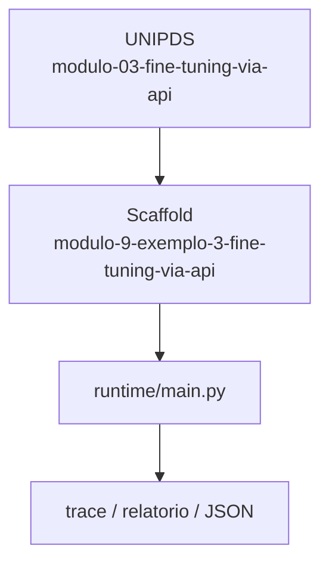
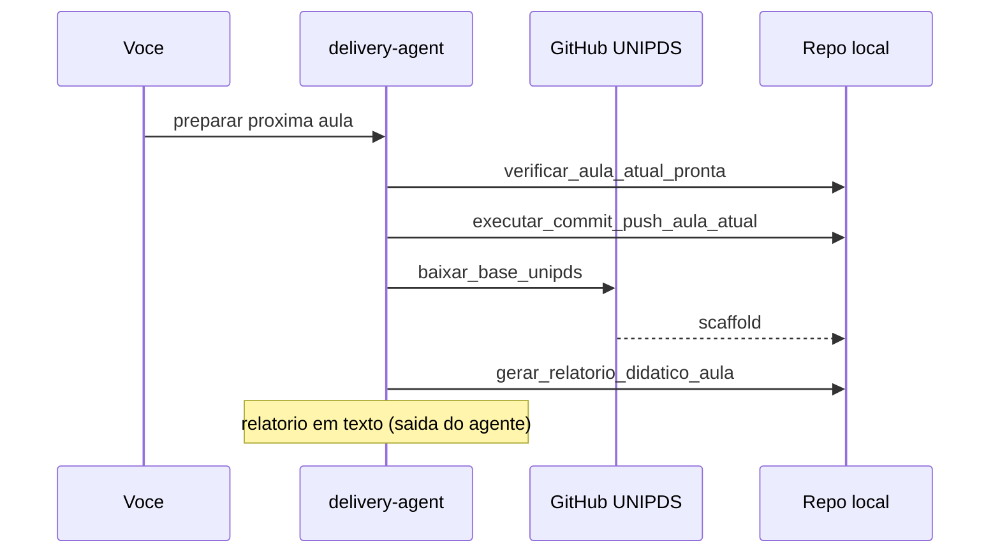

# Relatorio Didatico — Fine-Tuning via API

> Gerado pelo **delivery-agent** apos o scaffold da proxima aula.
> Pasta: `modulo-9-exemplo-3-fine-tuning-via-api` | Modulo 9 Exemplo 3 | [modulo-03-fine-tuning-via-api](https://github.com/unipds-engenharia-de-ia-aplicada/engenharia-de-software-com-ia-aplicada/tree/main/modulo09-processamento-de-dados-e-fine-tuning-de-modelos/modulo-03-fine-tuning-via-api)

---

## Resumo visual

### Arquitetura do exemplo



### Fluxo de preparacao



### Mapa do scaffold

```
modulo-9-exemplo-3-fine-tuning-via-api/
├── README.md
└── ... (26 arquivos)
```

---

## Principais topicos abordados

### 1. Upload e tracking

Subir dataset, acompanhar job e registrar hiperparametros via API.

**Exemplo de uso:**
```bash
python dataset_upload_and_tracking_tool.py && python finetuning_automation_tool.py
```

### 2. Pipeline Dolly/Vertex

Starter Dolly + pipeline Vertex como alternativa real de treino.

**Exemplo de uso:**
```bash
python dolly_vertex_pipeline.py
```

### 3. Model card

Documentar modelo treinado (Amplitude auto/saude) pos-job.

**Exemplo de uso:**
```bash
cat model-card-amplitude-auto-saude-m3-200.md
```


---

## Secoes do README local

- Objetivo
- Pré-requisitos
- Configuração
- Como executar
- Critérios de sucesso

---

## Comandos CLI detectados

| Comando | Uso |
|---------|-----|
| `rodar` | `python main.py rodar --agente ../monitor-agent` |
| `validar` | `python main.py validar --agente ../monitor-agent` |


---

## Arquivos-chave

- (estrutura em construcao)

---

## Proximos passos

1. Leia `README.md` e o material UNIPDS
2. Configure `.env` (nunca commite segredos)
3. `python main.py validar --agente ../monitor-agent`
4. Execute a atividade e valide criterios de sucesso

---

*Gerado por `gerar_relatorio_didatico_aula` (delivery-agent).*
