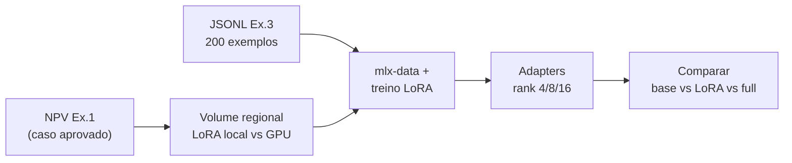

# Relatório Didático — LoRA e PEFT

> Análise da aula `modulo-9-exemplo-4-lora-e-peft`  
> Material UNIPDS: [modulo-04-lora-e-peft](https://github.com/unipds-engenharia-de-ia-aplicada/engenharia-de-software-com-ia-aplicada/tree/main/modulo09-processamento-de-dados-e-fine-tuning-de-modelos/modulo-04-lora-e-peft)  
> Caso: **Amplitude Seguros** — treino **local / PEFT** quando o gate do Ex.1 já passou, mas o custo de GPU na nuvem não fecha

---

## 1. Objetivo da aula

Mostrar **Parameter-Efficient Fine-Tuning (PEFT)**, em especial **LoRA**: adaptar o modelo com poucos parâmetros treináveis, versionar o adapter, e comparar com **full fine-tuning** em VRAM, tempo e qualidade.

**Mensagem central:** o “sim” do Decision Framework não obriga job Vertex caro. Com volume regional baixo, LoRA no hardware local (ou Colab) muda o NPV — o Ex.1 reabre a conta sem mudar a lógica de `calcular_npv`.

---

## 2. Estrutura pedagógica (3 camadas)

| Camada | Artefato (`materiais_aula/`) | Papel |
|--------|------------------------------|-------|
| **4.1 Economia** | `regional_lora_vs_cloud_npv` · `full_vs_lora_tradeoff_tool` | NPV Auto regional; tradeoff custo/VRAM |
| **4.2 Treino local** | `local_lora_training_*` · `mlx-data/` · Colab/HF | Dataset Ex.3 → MLX; treino sem API Vertex |
| **4.3–4.4 Rank + qualidade** | YAMLs de rank · `rank_adapter_*` · `adapter_comparison_*` · preview API | Rank 4/8/16; comparar adapters; LoRA gerenciado |

```mermaid
flowchart LR
  EX1["NPV Ex.1\n(caso aprovado)"]
  REG["Volume regional\nLoRA local vs GPU"]
  EX3["JSONL Ex.3\n200 exemplos"]
  MLX["mlx-data +\ntreino LoRA"]
  RANK["Adapters\nrank 4/8/16"]
  CMP["Comparar\nbase vs LoRA vs full"]

  EX1 --> REG
  EX3 --> MLX --> RANK --> CMP
  REG --> MLX
```

---

## 3. Conceitos-chave

### 3.1 NPV regional (reusa Ex.1)

`regional_lora_vs_cloud_npv` importa `calcular_npv` do Ex.1. Cenário: parcerias Sul/Nordeste (~400 orçamentos/mês vs 8.000 nacional). Custo fixo de “alugar GPU” (~R$2.400 ilustrativo) mata o caso; custo marginal LoRA local ≈ 0 (máquina já existe) → NPV vira positivo.

### 3.2 Mesmo dataset, outro schema

`local_lora_training_tool` lê `dataset-treinado.jsonl` do Ex.3 (`contents/role/parts`) e converte para `messages` (MLX-LM), com split train/valid/test em `mlx-data/`.

### 3.3 Rank do adapter

Configs `lora-rank4|8|16-config.yaml` e pastas `mlx-adapters*` mostram o tradeoff: rank maior → mais capacidade e arquivo maior. `rank_adapter_comparison_tool` compara os três.

### 3.4 Full vs LoRA (lição de infra)

Full FT do Gemma do curso pede ~15GB+ unificado no Mac; checkpoint full (~2GB) não cabe no GitHub — baixa via HF Hub (`guia-execucao-local-modulo-4-companion.md`). Em Colab T4, LoRA roda; full do modelo grande **não** — notebook full usa modelo menor (Qwen) só para sentir a mecânica.

### 3.5 Preview de LoRA gerenciado

`lora_managed_api_preview_tool` antecipa LoRA *via API* (caminho híbrido com Ex.3), sem confundir com o treino local MLX.

---

## 4. Pipeline sugerido (aceite didático)

1. Rodar NPV regional (Python ou Node).  
2. Confirmar path do JSONL Ex.3 e (se Mac) converter/treinar; senão abrir notebook Colab.  
3. Comparar ranks e adapters versionados.  
4. Ler companions de execução e tradeoff full vs LoRA.  
5. Ligar ao Guardião via `APLICACAO_M9_EX4_AO_GUARDIAO_M8.md`.

---

## 5. Mac vs Windows/Colab

| Ambiente | O que roda |
|----------|------------|
| Mac Apple Silicon + `mlx_lm` | Treino e generate locais oficiais |
| Windows/Linux sem MLX | Tools de NPV/comparação + Colab/HF |
| Colab T4 | LoRA real; full só em escala reduzida |

---

## 6. Arquivos-chave

| Arquivo | Função |
|---------|--------|
| `regional_lora_vs_cloud_npv.*` | Decisão financeira LoRA local |
| `local_lora_training_tool.*` | Conversão + orquestração MLX |
| `mlx-adapters*` / `mlx-data/` | Artefatos de treino |
| `full_vs_lora_tradeoff_tool.*` | Números da comparação |
| `colab-*-notebook.ipynb` | Alternativa não-Mac |
| `Atividade 4 - Módulo 4.pdf` | Missão prática UNIPDS |

---

## 7. Ponte Módulo 9

| Exemplo | Ligação |
|---------|---------|
| Ex.1 | NPV e gate — aqui muda o *veículo* do treino |
| Ex.2 | Qualidade do dado que alimenta o adapter |
| Ex.3 | Job gerenciado vs LoRA local no mesmo corpus |
| Ex.5 | Avaliação base vs adapter |
| Ex.6 | Escolha de stack no projeto final |

---

## 8. Critérios de sucesso (aprendizagem)

- [ ] Explicar LoRA/PEFT em uma frase (poucos parâmetros treináveis + adapter)  
- [ ] Usar NPV regional para decidir LoRA local vs GPU alugada  
- [ ] Saber que o dataset vem do Ex.3 e muda de schema  
- [ ] Relacionar rank a capacidade/tamanho  
- [ ] Distinguir full FT (caro) de LoRA (barato/descartável)  
- [ ] Aplicar ao Guardião sem autorizar FT do monorepo  

---

*Relatório no padrão documental dos Ex.1–3, alinhado ao material UNIPDS Amplitude LoRA/PEFT.*
