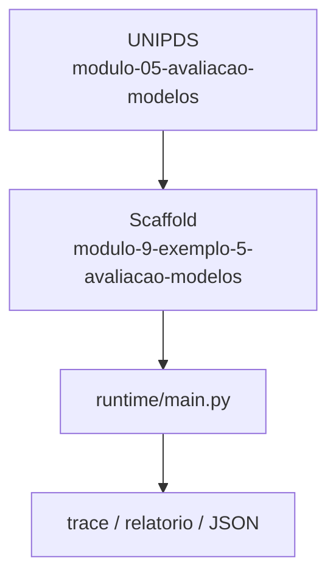
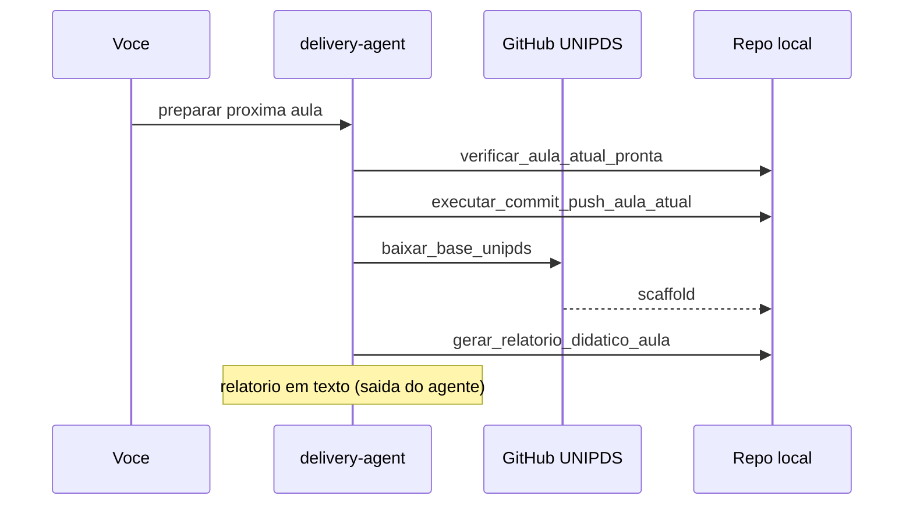

# Relatorio Didatico — Avaliacao de Modelos

> Gerado pelo **delivery-agent** apos o scaffold da proxima aula.
> Pasta: `modulo-9-exemplo-5-avaliacao-modelos` | Modulo 9 Exemplo 5 | [modulo-05-avaliacao-modelos](https://github.com/unipds-engenharia-de-ia-aplicada/engenharia-de-software-com-ia-aplicada/tree/main/modulo09-processamento-de-dados-e-fine-tuning-de-modelos/modulo-05-avaliacao-modelos)

---

## Resumo visual

### Arquitetura do exemplo



### Fluxo de preparacao



### Mapa do scaffold

```
modulo-9-exemplo-5-avaliacao-modelos/
├── README.md
└── ... (22 arquivos)
```

---

## Principais topicos abordados

### 1. Evaluation harness

Suite de avaliacao local + LLM-as-judge e stress de overfitting.

**Exemplo de uso:**
```bash
python model_evaluation_harness_tool.py && python overfitting_stress_test_tool.py
```

### 2. A/B e dominio

Tradeoff auto vs saude e veredito de escala.

**Exemplo de uso:**
```bash
python ab_and_domain_tradeoff_tool.py
```

### 3. NPV real vs projetado

Comparar retorno medido com projecao de negocio.

**Exemplo de uso:**
```bash
python npv_real_vs_projetado_tool.py && cat resultado-medido.json
```


---

## Secoes do README local

- Objetivo
- Pré-requisitos
- Configuração
- Como executar
- Critérios de sucesso

---

## Comandos CLI detectados

| Comando | Uso |
|---------|-----|
| `rodar` | `python main.py rodar --agente ../monitor-agent` |
| `validar` | `python main.py validar --agente ../monitor-agent` |


---

## Arquivos-chave

- (estrutura em construcao)

---

## Proximos passos

1. Leia `README.md` e o material UNIPDS
2. Configure `.env` (nunca commite segredos)
3. `python main.py validar --agente ../monitor-agent`
4. Execute a atividade e valide criterios de sucesso

---

*Gerado por `gerar_relatorio_didatico_aula` (delivery-agent).*
