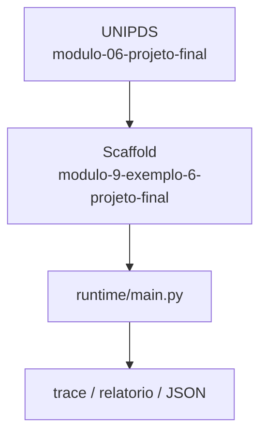
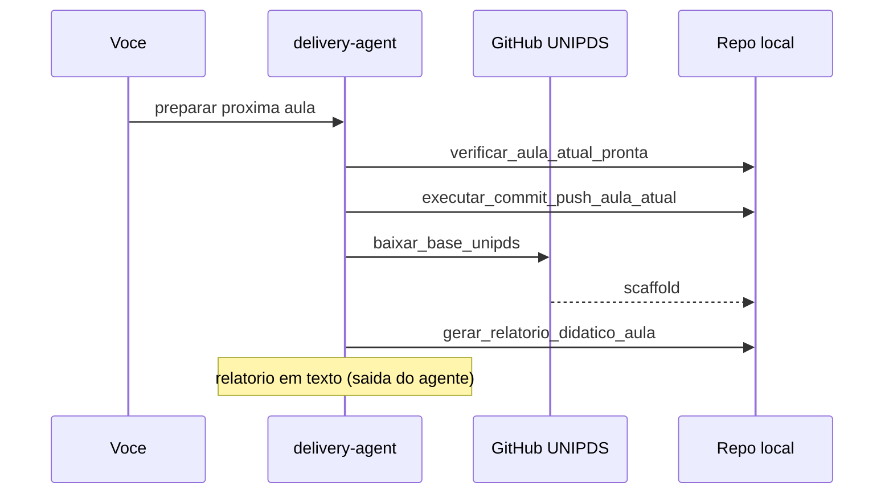

# Relatorio Didatico — Projeto Final Amplitude

> Gerado pelo **delivery-agent** apos o scaffold da proxima aula.
> Pasta: `modulo-9-exemplo-6-projeto-final` | Modulo 9 Exemplo 6 | [modulo-06-projeto-final](https://github.com/unipds-engenharia-de-ia-aplicada/engenharia-de-software-com-ia-aplicada/tree/main/modulo09-processamento-de-dados-e-fine-tuning-de-modelos/modulo-06-projeto-final)

---

## Resumo visual

### Arquitetura do exemplo



### Fluxo de preparacao



### Mapa do scaffold

```
modulo-9-exemplo-6-projeto-final/
├── README.md
└── ... (19 arquivos)
```

---

## Principais topicos abordados

### 1. Assistente Amplitude

Fechar o ciclo: dataset de producao, decisoes de arquitetura e chamada ao modelo.

**Exemplo de uso:**
```bash
python chamar_modelo_local.py && cat decisoes-de-arquitetura.md
```

### 2. Escala e verificacao

Scaling do dataset e verificacao do modelo apos escala.

**Exemplo de uso:**
```bash
python m6_dataset_scaling_tool.py && python m6_scaled_model_verification_tool.py
```

### 3. Geracao sintetica

Guia para expandir dados via LLM com reavaliacao pos-escala.

**Exemplo de uso:**
```bash
cat guia-geracao-sintetica-via-llm.md guia-reavaliacao-pos-escala.md
```


---

## Secoes do README local

- Objetivo
- Pré-requisitos
- Configuração
- Como executar
- Critérios de sucesso

---

## Comandos CLI detectados

| Comando | Uso |
|---------|-----|
| `rodar` | `python main.py rodar --agente ../monitor-agent` |
| `validar` | `python main.py validar --agente ../monitor-agent` |


---

## Arquivos-chave

- (estrutura em construcao)

---

## Proximos passos

1. Leia `README.md` e o material UNIPDS
2. Configure `.env` (nunca commite segredos)
3. `python main.py validar --agente ../monitor-agent`
4. Execute a atividade e valide criterios de sucesso

---

*Gerado por `gerar_relatorio_didatico_aula` (delivery-agent).*
